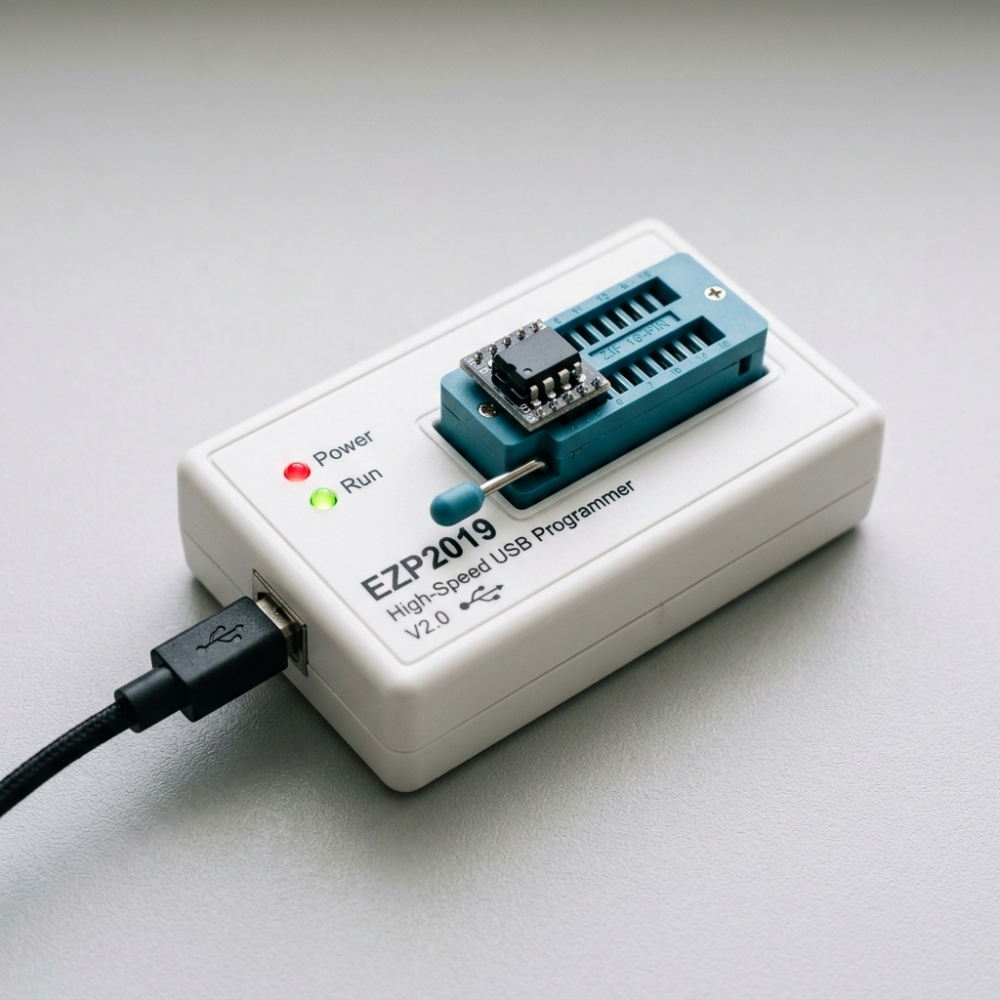

# EZP2019 USB Programmer Utility



A Linux-based driver and command-line utility for the **EZP2019 High-Speed USB Programmer**. This project provides an open-source alternative to the proprietary Windows software, allowing users to interact with various memory chips (EEPROM, SPI Flash) directly from the Linux terminal.


## Features

- **Direct USB Communication**: Interacts with the programmer using `libusb-1.0`.
- **Hardware Detection**: Verify connection to the EZP2019 programmer.
- **IC Identification**: Retrieve information about the connected memory chip.
- **Cross-Platform Potential**: Built using C and standard libraries for portability.

## Supported Hardware

- **Device**: EZP2019 USB Programmer
- **USB VID**: `0x1fc8`
- **USB PID**: `0x310b`

## Dependencies

Ensure the following dependencies are installed on your system:

- `libusb-1.0`
- `pkg-config`
- `cmake` (3.10 or higher)
- A C23 compatible compiler (e.g., GCC 14+)

On Ubuntu/Debian:
```bash
sudo apt update
sudo apt install libusb-1.0-0-dev pkg-config cmake gcc
```

## Build Instructions

Use the provided `build.sh` script to configure and build the project:

```bash
./build.sh
```

This will create a `build` directory containing the `ezp2019` executable and a `libezp2019.so` shared library.

## USB Permissions (Linux)

By default, most Linux distributions restrict access to USB devices for non-root users. To allow all users to access the EZP2019 programmer without `sudo`, you can install a udev rule:

1. **Create the rule file:**
   ```bash
   sudo bash -c 'echo "SUBSYSTEM==\"usb\", ATTR{idVendor}==\"1fc8\", ATTR{idProduct}==\"310b\", MODE=\"0666\"" > /etc/udev/rules.d/99-ezp2019.rules'
   ```

2. **Reload and apply the rules:**
   ```bash
   sudo udevadm control --reload-rules && sudo udevadm trigger
   ```

3. **Replug the device:**
   Unplug and replug your EZP2019 programmer for the changes to take effect.

## Usage

Run the utility from the `build` directory:

```bash
./build/ezp2019 <command>
```

### Available Commands

- `is_connected`: Checks if the EZP2019 programmer is connected.
- `connected_ic`: Retrieves ID/data from the connected IC.
- `read_ic`: Reads the entire contents of the connected IC.

> [!WARNING]
> The following commands are defined but currently **Not Implemented**:
> - `write_ic`
> - `verify_ic`
> - `erase_ic`

### Example
Checking if the programmer is connected:
```bash
./build/ezp2019 is_connected
```
Checking connected IC info:
```bash
./build/ezp2019 connected_ic
```
Reading contents of the connected IC and saving to a file:
```bash
./build/ezp2019 read_ic > output.bin
```

> [!WARNING]
> The following commands are currently **Not Implemented**:
> Writing contents of a file to the connected IC:
```bash
./build/ezp2019 write_ic < input.bin
```
Verifying the contents of a file against the connected IC:
```bash
./build/ezp2019 verify_ic < input.bin
```
Erasing the connected IC:
```bash
./build/ezp2019 erase_ic
```

## Development Tools

### Chip Database Generator

The project includes a Python script to convert the binary `ezp2019.dat` chip database into a C header file (`ezp2019_chips.h`). This is useful for updating the list of supported devices.

**Usage:**
```bash
python3 ezp2019_gen_header.py ezp2019.dat -o ezp2019_chips.h
```

## License


This project is licensed under the **MIT License**. See the [LICENSE](LICENSE) file for details.

---
Copyright (c) 2025 Boris Barbulovski
